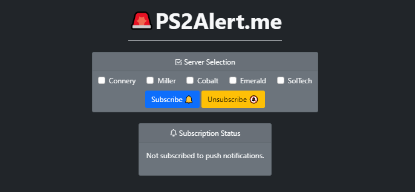
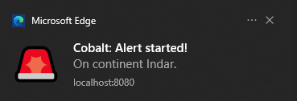
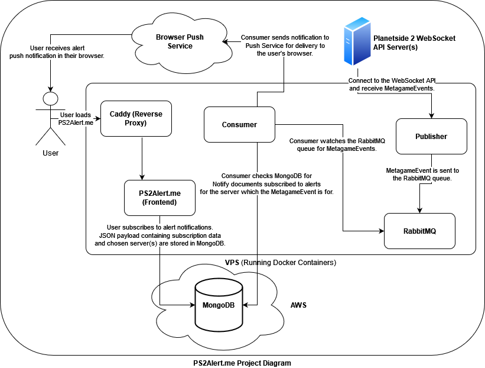

# 🚨 PS2Alert.me

Browser notifications for PlanetSide 2 alerts.



<p align="center">
  
</p>

## Project Dependencies

* [Express.js](https://expressjs.com/)

* [Helmet](https://www.npmjs.com/package/helmet)

* [cookie-parser](https://github.com/expressjs/cookie-parser)

* [csurf](https://github.com/expressjs/csurf)

* [mongo-sanitize](https://github.com/vkarpov15/mongo-sanitize)

* [web-push](https://www.npmjs.com/package/web-push)

* [Mongoose](https://mongoosejs.com/)

* [amqplib](https://github.com/squaremo/amqp.node)

* [ps2census](https://github.com/microwavekonijn/ps2census)

* [Pino](https://github.com/pinojs/pino)

### Service Worker

* [idb-keyval](https://github.com/jakearchibald/idb-keyval)

## Introduction

PS2Alert.me allows a user to receive push notifications for PlanetSide 2 alerts in their browser. The application achieves this by leveraging [Service Workers](https://developers.google.com/web/fundamentals/primers/service-workers), the [IndexedDB API](https://developer.mozilla.org/en-US/docs/Web/API/IndexedDB_API), [Push API](https://developer.mozilla.org/en-US/docs/Web/API/Push_API), [Notifications API](https://developer.mozilla.org/en-US/docs/Web/API/Notifications_API) and [Push Services](https://developers.google.com/web/ilt/pwa/introduction-to-push-notifications#push_notification_terms).

### Components

The project has several components:

1. Web application (frontend - PS2Alert.me):

    - Users select the PlanetSide 2 server(s) to subscribe to alert notifications for and a [Service Worker](frontend/sw.js) is registered to receive push notifications.

2. MongoDB (Backend):

    - A user's chosen server(s) to subscribe to alert notifications for and subscription data (forming the [Notify model](backend/models/notifyModel.mjs)) are stored in the database.

    - The web application and consumer interact with the database. Adding and removing Notify documents and retrieving them respectively.

3. RabbitMQ (Backend):

    - A messaging broker where *MetagameEvents* (alerts) are sent from the publisher (mentioned below) to a queue which is then consumed (by the consumer component).

4. Publisher (Backend):

    - Connects to the PlanetSide 2 WebSocket Event Stream and listens for *MetagameEvents*. When a *MetagameEvent* matching the [criteria](https://github.com/dbrennand/PS2Alert.me/blob/v2/backend/publisher/publisher.mjs#L53) occurs, the publisher sends the *MetagameEvent* to the queue.

5. Consumer (Backend):

    - Watches the RabbitMQ queue for *MetagameEvents*. When a *MetagameEvent* occurs in the queue, find all Notify documents that are subscribed to push notifications for the server which the *MetagameEvent* is occurring on and send a push notification to each.

The following image provides a high level overview of the PS2Alert.me components and how they interact with one another to send a push notification.



### How does PS2Alert.me send a push notification and what data is stored/collected?

The process of subscribing to push notifications is as follows:

1. A [Service Worker](frontend/sw.js) is registered in the browser. The Service Worker is responsible for:

    - Saving subscription data in the browser (more on this below).

    - Handling incoming push notifications from a push service. Each browser has its own push service.

2. The chosen server(s) are retrieved and a [subscription](https://developer.mozilla.org/en-US/docs/Web/API/PushSubscription) is created. The subscription contains an endpoint and encryption keys for sending a push notification securely.

3. The subscription data is saved in the browser using IndexedDB to handle future subscription updates. Details on this can be found in [#3](https://github.com/dbrennand/PS2Alert.me/issues/3#issuecomment-1048830172).

4. The chosen server(s) and subscription data are then sent to PS2Alert.me in JSON format (see example below):

    ```json
    {"subscription": {
        "keys": {
            "auth": "Ma--_fi1qKbIkRR-BWdjaL",
            "p256dh": "ALazAmWPKHJgS5RIpUTrokhJ-2F36BgtS4yHJ2i5wYFM12Rw5Dq6JgN0MZS-5XAtzOkA0fjd82_qDZ13u9R_ki0"
        },
        "endpoint": "https://updates.push.services.mozilla.com/wpush/v2/gADADABg7aLCNwpbXma7Xkx5Oy90BY_yfChS4GXeb8fKPAb5nAi77iRqPdljCA0hX_6ADgaShrAL0CQTwqzqCXLhROWNRH0ddTIn7Eb29o-2Zt13zEHGKlULC5VqOuWGgdXWbH8bEUX38jABy4APmgudRM4uiiJI2FjCWnWdo56-WQnC5EauYAM"
    }, "servers": [ "13" ]}
    ```

    > [!NOTE]
    >
    > Once steps 1-4 have occurred, the PS2Alert.me webpage can be closed. The beauty of the Service Worker is that it awakes when it receives a push notification from the push service (as long as the browser is running).

5. When an alert occurs for a server, all users subscribed to push notifications for that server are sent a push notification. The PS2Alert.me consumer is responsible for sending the push notification to the push service, which handles delivery of the notification to the user's browser.

The images below (from [Google Developers](https://developers.google.com/web/fundamentals/push-notifications/how-push-works)) provide a graphical representation of how a push notification is sent to a push service and handled by a Service Worker.


## Development and Deployment

The project stack can be deployed locally using [Docker](https://www.docker.com/).

## Deployment Prerequisites

1. A Daybreak Games Census API Service ID.

    - You can sign up for one [here](https://census.daybreakgames.com/#devSignup).

2. Node.js installed on your machine to perform step 3.

3. Install [web-push](https://www.npmjs.com/package/web-push) to generate VAPID public and private keys using the command: `npx web-push generate-vapid-keys`

4. Modify the [.env](.env) file providing all environment variables.

5. Modify [frontend/index.js](frontend/index.js#L2) and [frontend/sw.js](frontend/sw.js#L7) `const publicVapidKey = "";` with your generated VAPID public key.

## Deployment

Use the following steps to deploy the PS2Alert.me stack locally using Docker:

1. Clone the repository: `git clone https://github.com/dbrennand/PS2Alert.me.git && cd PS2Alert.me`

2. Bring up the project stack: `docker-compose -f docker-compose-dev.yaml up -d --build`

The frontend will then be available at: http://localhost:8080

## Authors -- Contributors

* [**dbrennand**](https://github.com/dbrennand) - *Author*

## License
This project is licensed under the GNU GENERAL PUBLIC LICENSE Version 3 - see the [LICENSE](LICENSE) for details.
